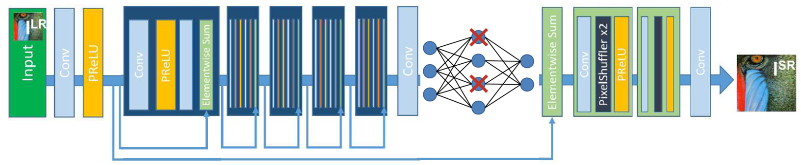
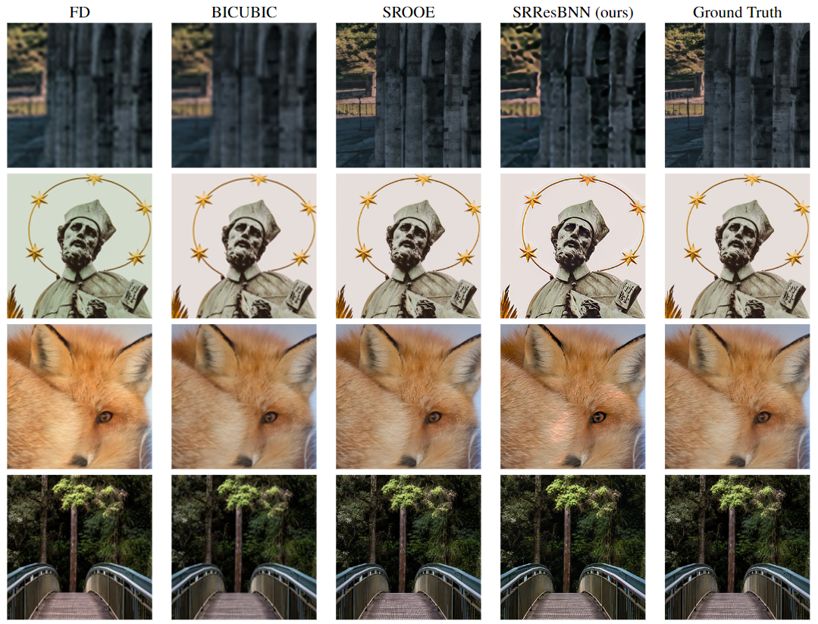
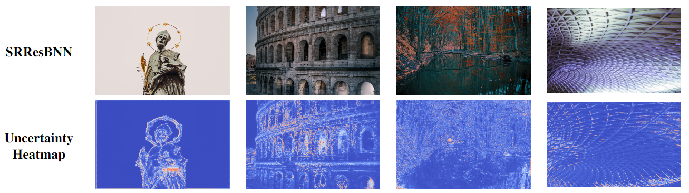

# Towards Explainable Super-Resolution: A Stochastic Deep Learning Approach with Confidence Heatmaps

# Introduction
The rapid advancements in digital imaging technology have markedly increased the demand for high-resolution (HR) images across various fields, including medical imaging, satellite imagery, and surveillance. However, the inherent limitations of imaging sensors often lead to the acquisition of low-resolution (LR) images, which lack the necessary clarity and detail. This challenge has spurred the development of a specialized research area focused on reconstructing HR images from their corresponding LR counterparts, commonly referred to as super-resolution (SR). While this field has garnered significant attention, the explainability of SR generation models has remained largely unexplored.

In this paper, we introduce an innovative SR model, SRResBNN, that leverages the strengths of ensemble methods for predictions' explainability. Our model is built upon the SRResNet architecture, pre-trained, and evaluated on the DIV2K dataset. The proposed model demonstrates competitive performance, surpassing several existing SR models in terms of PSNR and SSIM metrics. Quantifying the uncertainty of deep neural network predictions poses a significant challenge. To address this, we incorporate dropout and Bayesian statistical techniques. Our model generates uncertainty heatmaps that identify regions of difficulty during the SR process, thereby providing valuable insights into the model’s decision-making and enhancing overall interpretability.

## SRResBNN Architecture  ##

## Usage:

### Environments
- Pytorch 1.13.1
- CUDA 11.7
- Python 3.8

### Files
Make sure you have all files including the other repositories and organize them in the above structure directory.

 - SRResBNN: download the pre-trained SRResBNN model [here](https://drive.google.com/file/d/1Mx7QX_c4f898NV8IzDBpa6hOzDRD2AaG/view?usp=sharing).
 - SPSR: https://github.com/Maclory/SPSR
 - SROOE: https://github.com/seungho-snu/SROOE

Configure the .yml or .json file according to their instructions. 

### Test

Before running the test code, make sure your dataset structure is the same as mentioned in the Data section.

To test the pre-trained SRResBNN model, make sure the configuration in test.sh is the same as:

    python main.py --model 'srresbnn' \
                   --model_type 'srresnet' \
                   --model_path './modules/SRResBNN/models/SRResBNN/SRResBNN_4000.pt' \
                   --mode 'test' \
                   --num_workers 8 \
                   --batch_size 1 \
                   --bnn True \
                   --cuda True

Then, to test the pre-trained model:

    bash test.sh
    
To test other models, change model and model_type.

For example, Traditional methods - BICUBIC:

    python main.py --model 'trad' \
               --model_type 'bicubic' \
               --mode 'test' \
               --num_workers 8 \
               --batch_size 1 \

SPSR:

    python main.py --model 'spsr' \
                   --mode 'test' \
                   --num_workers 8 \
                   --batch_size 1 \
                   --cuda True

### Training

To pre-train SRResBNN model:

    bash pretrain_srresbnn.sh

### Evaluate

In order to evaluate a given model:

    bash evaluate.sh

Make sure to specify the correct SR results folder, for example to evaluate SRResBNN:

    --db_valid_sr_path './modules/SRResBNN/results/SRResBNN'

# Data
The data that was used for training is the DIV2K (RGB images with a large diversity of contents) dataset. Dataset can be downloaded [here](https://data.vision.ee.ethz.ch/cvl/DIV2K/).

The DIV2K dataset is divided into:
  * train data: starting from 800 high definition high resolution images and corresponding low resolution images. Both high and low resolution images are provided for 2, 3, and 4 downscaling factors.
  * validation data: 100 high definition high resolution images are used for genereting low resolution corresponding images.

Only train data has been used and validation data was created by ourselves.

Dataset structure should be of the following:

    dataset
    ├── DIV2K_train_HR
    ├── DIV2K_train_LRx4
    ├── DIV2K_valid_HR
    └── DIV2K_valid_LRx4

# Results

<table>
  <thead>
    <tr>
      <th>Method</th>
      <th>PSNR &uarr;</th>
      <th>SSIM &uarr;</th>
      <th>LPIPS &darr;</th>
    </tr>
  </thead>
  <tbody>
    <tr>
      <td>SRResBNN (ours)</td>
      <td><em>28.859</em></td>
      <td><em>0.740</em></td>
      <td><em>0.309</em></td>
    </tr>
    <tr>
      <td>SROOE</td>
      <td>29.113</td>
      <td>0.727</td>
      <td><strong>0.098</strong></td>
    </tr>
    <tr>
      <td>SPSR</td>
      <td>28.197</td>
      <td>0.697</td>
      <td>0.112</td>
    </tr>
    <tr>
      <td>SRResNet</td>
      <td><strong>30.247</strong></td>
      <td><strong>0.774</strong></td>
      <td>0.288</td>
    </tr>
    <tr>
      <td>SRGAN</td>
      <td>28.698</td>
      <td>0.705</td>
      <td>0.179</td>
    </tr>
    <tr>
      <td>FD</td>
      <td>23.465</td>
      <td>0.676</td>
      <td>0.437</td>
    </tr>
    <tr>
      <td>BICUBIC</td>
      <td>28.116</td>
      <td>0.728</td>
      <td>0.420</td>
    </tr>
  </tbody>
</table>

<em>Results on DIV2K validation dataset (scale factor of 4)</em>

Our model achieved a PSNR of 28.859, SSIM of 0.740, and LPIPS of 0.309 on the validation set using the BNN inference and was compared to other relevant SR models. 
Surpassing SRGAN, BICUBIC, FD, and SPSR in PSNR, and also SROOE in SSIM. On the other hand, in LPIPS the results are low.

# Explainability

Confidence heatmaps are produced with an HSV conversion and STD calculation out of the BNN predictions. This heatmap indicates the level of certainty per pixel, 
from cool to warm colors while cool represents a high level of certainty and warm low level of certainty.

Confidence heatmaps are produced during test.sh in the following structure:

    SRResBNN
    ├── models
    ├── pre-trained
    └── results
        ├──> SRResBNN
                └──> STD

